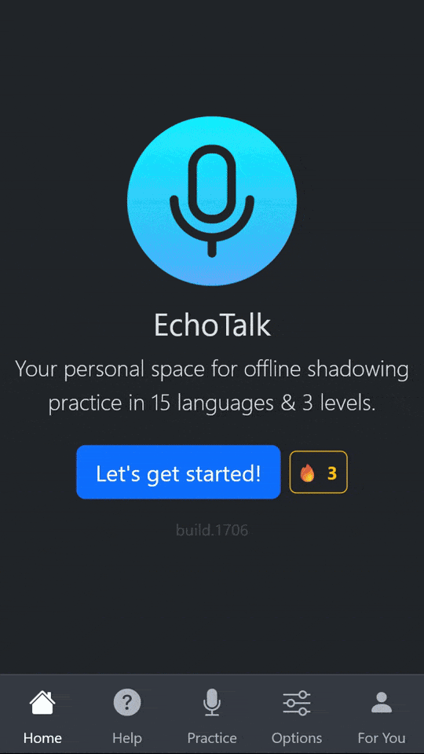

# EchoTalk – Offline Shadowing Practice 🗣️


 <!-- COVERAGE_BADGE_LINE -->

EchoTalk is a **privacy-first, offline language training tool** that helps you master the **Shadowing** technique for improving pronunciation, fluency, and confidence. It works as a **Progressive Web App (PWA)**, requires no server, and keeps all your recordings securely on your device.

🔗 Live Demo: [**(alisolphp.github.io/EchoTalk)**](https://alisolphp.github.io/EchoTalk/)

🔗 Mirror Server: [**(alisol.ir/EchoTalk)**](https://alisol.ir/EchoTalk/)



---

## ✨ Features

### 🧠 Smart Training & Learning Modes

* **Skip-Only, Check, and Auto-Skip modes** for flexible practice styles.
* **Auto Repetition & Auto Speed** that adapt dynamically to your progress.
* **Repetition counters** so you always know how many loops are left.
* **AI Personal Teacher**:
  - Get fast, targeted analysis of your **pronunciation & fluency** (word-by-word guidance).
  - Generate **context/nuance insights** and **creative practice** (variations, opposites, Q&A, fill-in-the-blank) to remember meanings better and faster.

### 📝 Rich Content
* Large ready-made sentence packs organized by **level** and **category**.
* Personalized sample sentences by language, level, and topic.
* Word-level tools: click any word for meaning/pronunciation and AI-powered analysis.

### 🤖 AI Integrations & Extensions
* Grammar help, translations, and vocabulary expansion via AI.
* Creative exercises (opposites, variations, quizzes) with ChatGPT/Gemini prompts.
* Fast AI pronunciation analysis of your recordings (offline prompts supported).

### 🎨 Modern UI/UX

* **Multi-language support**: English, Dutch, Polish, Portuguese, Russian, Turkish, and more.
* **Word-level interaction**: click a word to open tools for meaning, pronunciation, and AI-powered analysis.
* **Practice streak tracker** with calendar view and motivational messages.
* **History & recordings**: review all your past practices and replay your recordings.
* **Seamless flows**: restart or switch sentences easily, plus celebration animations after sessions.
* **Live recording visualizer** for instant feedback.

### ♿ Accessibility

* Adjustable **TTS speed** (slow → furious).
* **Keyboard-only navigation** for mouse-free practice.
* **Screen reader friendly** with live progress announcements.

### ⚙️ Technology & Performance

* **Works fully offline** after first load.
* **Optimized for Chrome & mobile browsers** (with fallbacks for others).
* **PWA with auto-updates** and local caching for fast startup.
* **Version & build info** displayed in-app for easy bug reporting.
* **IndexedDB storage** for recordings and practice history.
* **Service Worker caching** for instant load times.

---

## 🚀 Getting Started

1. Enter or pick a sentence (or use a personalized sample).
2. Choose your language, level, and practice mode.
3. Click **Start Practice**.
4. Enable microphone recording (optional).
5. Listen, shadow, and track your progress.

---

## 🛠️ Technologies

* [Vite](https://vitejs.dev/) + TypeScript
* [Bootstrap 5](https://getbootstrap.com/) & Bootstrap Icons
* IndexedDB for offline storage
* Web Speech API (TTS)
* MediaRecorder API
* PWA + Service Worker
* Vitest for unit testing

---

## 🧪 Tests

EchoTalk has **200+ unit tests** covering:

* Practice logic and session flow
* State management and persistence
* Audio recording and playback
* IndexedDB integration
* UI event handling and DOM updates
* Utility functions (segmentation, similarity, text cleaning)


### Coverage Summary
<!-- COVERAGE_TABLE_START -->
| File | % Stmts | % Branch | % Funcs | % Lines |
| ---- | ------- | -------- | ------- | ------- |
| src/app.ts | 71.93 | 70.88 | 80.95 | 71.93 |
| src/types.ts | 100 | 100 | 100 | 100 |
| src/services/ai.service.ts | 97.43 | 90.38 | 100 | 97.43 |
| src/services/audio.service.ts | 72.41 | 88.31 | 80 | 72.41 |
| src/services/data.service.ts | 84.83 | 78.48 | 78.26 | 84.83 |
| src/services/practice.service.ts | 76.75 | 77.14 | 72.72 | 76.75 |
| src/services/prompts.service.ts | 100 | 100 | 100 | 100 |
| src/services/ui.service.ts | 84.28 | 89.06 | 80.76 | 84.28 |
| src/services/util.service.ts | 92.68 | 88 | 100 | 92.68 |
| src/utils/string.extensions.ts | 100 | 100 | 100 | 100 |
| All files | 80.48 | 82.81 | 83.22 | 80.48 |
<!-- COVERAGE_TABLE_END -->

---

## 📦 Installation

```bash
git clone https://github.com/alisolphp/EchoTalk.git
cd EchoTalk
npm install
npm run dev
```

Run tests:

```bash
npx vitest run --coverage
```

Build for production:

```bash
npm run build
```

---

## ⚠️ Limitations & Browser Support

* **Built-in Speech-to-text (STT)** is not yet implemented.
* **Best performance on Chrome & Android browsers**.
* Safari and Firefox may have limited IndexedDB quota or recording issues.

---

## 🧑‍🔧 Roadmap

* ✅ Multi-language support & sentence history
* ✅ Practice streak tracker with calendar
* ✅ AI integrations for grammar, translation, and pronunciation
* ✅ Offline-first with recordings saved locally

### Next Up

* [ ] **STT integration** for real-time pronunciation scoring
* [ ] **Export tools** for recordings
* [ ] **Explore & browse sentences by level and category**
* [ ] **Gamification** (badges, levels, rewards)
* [ ] **Community sharing features**

### 🔮 Planned Enhancements

* [ ] **Custom Video & Subtitle Upload**
    - Users can upload their favorite movies or clips along with subtitle files.
    - Practice with content they love, in the exact accent they want to train.
    - Facial expressions and lip movements become part of the shadowing experience.

* [ ] **YouTube API Integration**
    - Let users pick and practice directly with YouTube videos.
    - Faster and easier than manual video + subtitle uploads.
    - ⚠️ Planned for the future due to API costs and potential complexity.


---

## 🧑‍💻 Contributing

Contributions are welcome! You can:

* Report bugs
* Suggest features
* Improve code or docs

Fork the repo, make your changes, and open a pull request.

---

## 📄 License

MIT License – see [LICENSE](./LICENSE).
